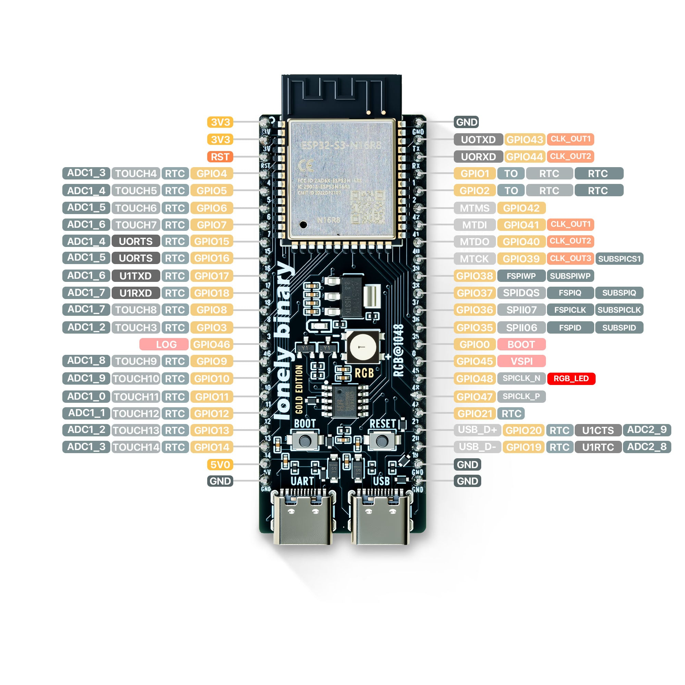

[← All boards](../) · [← Plugin (system overview)](https://github.com/sep/cc-status-plugin)

# Lonely Binary ESP32-S3 N16R8 Gold Edition

**Wiring & flash instructions for ClaudePanel display firmware.**

## What you'll need

- Lonely Binary ESP32-S3 N16R8 Gold Edition board
- WaveShare RGB-Matrix-P2.5-64×32 (or any HUB75 panel of compatible size)
- External 5 V power supply for the panel — 2 A peak rating, 4 A recommended
- Jumper wires (13 signal lines + at least one ground)
- USB-C cable to your computer
- **Recommended:** 10 kΩ resistor for OE pull-up (see below)
- **Optional:** a momentary push button if you want a dedicated "ack" control off-board — the BOOT button on the dev board works by default (see [The ack button](#the-ack-button))

## Wiring

### HUB75 → GPIO map

All HUB75 pins on this board live on the **left header, GPIO 4–16
contiguously** — a clean ribbon-cable layout. Conventional R/G/B order,
no swaps. Pin 8 (E) on the panel's IDC is unused on a 1/16-scan panel;
leave it disconnected.

| IDC pin # | Color / signal           | ESP32 GPIO   |
| --------- | ------------------------ | ------------ |
| 1         | R (top half)             | GPIO 4       |
| 2         | B (top half) ★           | GPIO 5       |
| 3         | G (top half) ★           | GPIO 6       |
| 4         | GND                      | any GND pin  |
| 5         | R (bottom half)          | GPIO 7       |
| 6         | B (bottom half) ★        | GPIO 8       |
| 7         | G (bottom half) ★        | GPIO 9       |
| 8         | E (NC on 1/16-scan)      | —            |
| 9         | A (row select)           | GPIO 10      |
| 10        | B (row select)           | GPIO 11      |
| 11        | C (row select)           | GPIO 12      |
| 12        | D (row select)           | GPIO 13      |
| 13        | CLK                      | GPIO 14      |
| 14        | LAT                      | GPIO 15      |
| 15        | OE                       | GPIO 16      |
| 16        | GND                      | any GND pin  |

★ **Panel-quirk note:** on the WaveShare RGB-Matrix-P2.5-64×32 panel, IDC
pins 2 and 3 (and 6 and 7) are **swapped vs the HUB75 standard** — pin 2
internally drives the blue channel, pin 3 drives green. The firmware
compensates so that the natural sequential wiring above renders colors
correctly. If you substitute a different (HUB75-spec-compliant) panel,
edit `main/board_config.h` to swap `g1↔b1` and `g2↔b2` back to
conventional order.

### Board pinout reference

<figure>
  
  <figcaption>
    Image © Lonely Binary, used with attribution.
    <a href="https://lonelybinary.com/en-us/products/s3">Source</a>.
  </figcaption>
</figure>

### Pins to avoid on this board

The N16R8 module uses octal PSRAM, which means GPIO 33–38 are reserved
internally by the chip even though some of them appear on the right
header (you'll see `SUBSPI*` labels). Don't try to use those for HUB75
or anything else — they'll fight the PSRAM. GPIO 19/20 are the native
USB lines, GPIO 43/44 are UART0 (logging), GPIO 48 is the onboard RGB
LED.

### Power

- Panel: external 5 V supply, ~2 A peak. **Don't try to power the panel
  from the ESP32's 5 V rail** — USB can't supply enough current.
- ESP32: USB-C from your computer.
- **Tie the panel's GND to one of the ESP32's GND pins.** Without a
  shared ground reference the data signals will be unstable even though
  the panel may appear to power up.

## Flash this board

Plug the ESP32-S3 into your computer with a USB-C cable, then click below.
Chrome, Edge, or another Chromium-based browser is required.

<p>
  <esp-web-install-button manifest="../firmware/lonely_binary_n16r8/manifest.json">
    <button slot="activate" class="btn">Flash Lonely Binary</button>
    <span slot="unsupported">Your browser doesn't support WebSerial. Try Chrome, Edge, or another Chromium-based browser.</span>
    <span slot="not-allowed">WebSerial requires HTTPS. Make sure you're on https://.</span>
  </esp-web-install-button>
</p>

## Verify it works

1. Power the panel from your external 5 V supply.
2. After flashing finishes, the panel should show **"…"** in dim blue
   near the center, with a slow-breathing blue border. That's the
   firmware's "unknown" state — the chip is alive but no host has sent
   it any state yet.
3. Quick smoke test from a terminal (macOS):

   ```sh
   PORT=/dev/cu.usbmodem*    # tab-complete to the real path
   stty -f $PORT 115200 cs8 -cstopb -parenb raw
   echo '{"state":"working","subagent_count":2}' > $PORT
   ```

   Panel should switch to amber **WORKING** with a faster pulsing border
   and two amber bars near the bottom edge.

## The ack button

The **BOOT button** on your dev board is a single context-sensitive ack —
each press resolves the loudest thing on the panel.

### What happens on each press

1. **Loud `BLOCKED` strobe?** First press silences it. The strobing
   stops, BLOCKED text + indicators drop to a calm muted appearance, the
   state stays visible. The silence auto-clears once no slot on this ESP
   is blocked anymore, so the next blocked event re-alarms fresh.
2. **Already silenced, or nothing blocked?** The press toggles AFK
   instead. So "I see it, going to lunch" is two presses while standing
   at the panel: silence, then AFK. The panel dims to ~10% with no
   animation, no strobing, no RX pulses. Even a fresh `BLOCKED`
   arriving while you're gone renders calm and dim — neighbors get
   nothing but a faint glow.
3. **Coming back?** Press once to exit AFK. If a block is still active,
   it's auto-silenced on wake so the panel doesn't start strobing the
   moment you sit down.

AFK itself persists across state changes — the panel stays dim until you
press again, even if Claude finishes a long-running task while you're
away.

### Auto-AFK on bridge silence

The panel also dims itself automatically when no bytes have arrived from
the bridge for 30 seconds — long enough to rule out a hiccup, short
enough to feel responsive. This catches "Pause subscription" tray clicks,
bridge crashes, host sleep, and USB unplug with the same calm visual.
Auto-AFK self-clears the moment any byte arrives again.

The bottom-left bridge-heartbeat pixel goes red 10 seconds into a silence
and stays red until bytes resume; auto-AFK kicks in 20 seconds after
that. Two stages, easy to read.

On this board GPIO 0 is wired only to the BOOT button (no LED conflict),
so it's a clean, reliable input.

### Optional: wire your own button

If you want a button somewhere more reachable than the dev board itself
(e.g., taped to your desk near your keyboard), wire a momentary push
button between any free GPIO and a GND pin. Then edit
`BoardPins.ack_button` in `main/board_config.h` to that GPIO number,
rebuild, and flash.

**No external pull-up resistor needed** — the firmware enables the
ESP32's internal pull-up (~45 kΩ).

- One button terminal → ESP GPIO (e.g., GPIO 21 or 42 — both free and
  exposed on this board)
- Other button terminal → any GND pin
- Active-low: not pressed reads HIGH, pressed reads LOW.

For long wire runs (more than ~30 cm) or electrically noisy environments,
an external 10 kΩ resistor between the GPIO and 3V3 adds noise immunity
but isn't required. Mechanical bounce is already handled in firmware (60
ms debounce), so a bypass capacitor is unnecessary.

## Optional: hardware OE pull-up

At chip reset, OE (GPIO 16) is briefly high-impedance before the firmware
takes over — this can cause a quick visual flash on the panel at boot. To
suppress it, solder a 10 kΩ resistor between OE and 3V3. The firmware's
early-OE-high block in `app_main()` trims the window further but a
hardware pull-up is the clean fix.

---

[← All boards](../) ·
[github.com/sep/cc-status-display](https://github.com/sep/cc-status-display) ·
[Wire-protocol spec](https://github.com/sep/cc-status-bridge/blob/main/docs/FIRMWARE.md)

<script
  type="module"
  src="https://cdn.jsdelivr.net/npm/esp-web-tools@10.2.1/dist/web/install-button.js?module"
></script>
