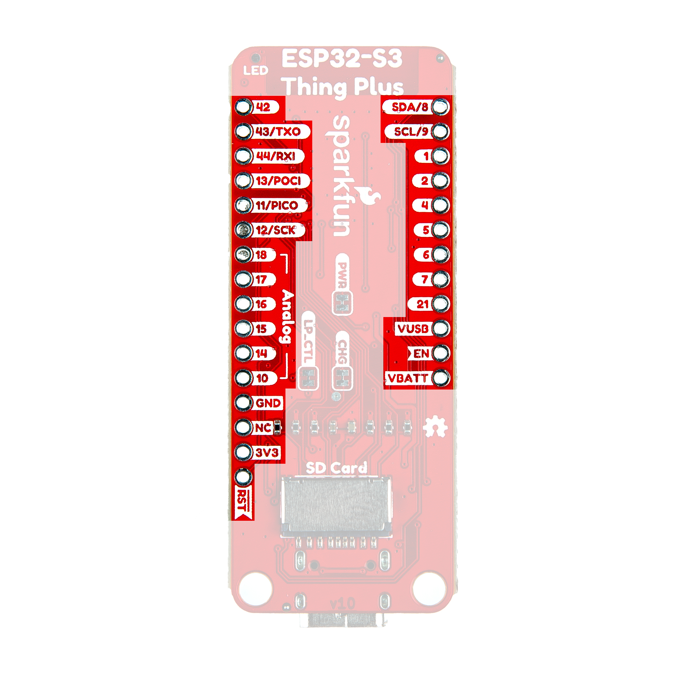

[← All boards](../) · [← Plugin (system overview)](https://github.com/sep/cc-status-plugin)

# SparkFun Thing Plus ESP32-S3

**Wiring & flash instructions for ClaudePanel display firmware.**

## What you'll need

- SparkFun Thing Plus ESP32-S3 board
- WaveShare RGB-Matrix-P2.5-64×32 (or any HUB75 panel of compatible size)
- External 5 V power supply for the panel — 2 A peak rating, 4 A recommended
- Jumper wires (13 signal lines + at least one ground)
- USB-C cable to your computer
- **Recommended:** 10 kΩ resistor for OE pull-up (see below)
- **Optional:** a momentary push button if you want a dedicated "ack" control off-board — the BOOT button on the dev board works by default (see [The ack button](#the-ack-button))

## Wiring

### HUB75 → GPIO map

Wire each panel signal to the listed ESP32 GPIO. The firmware's pin
assignments for this board are baked in — don't substitute "conventional"
HUB75 pin orderings or colors will be wrong. Pin 8 (E) on the panel's IDC
is unused on a 1/16-scan panel; leave it disconnected.

| IDC pin # | Color / signal           | ESP32 GPIO   |
| --------- | ------------------------ | ------------ |
| 1         | R (top half)             | GPIO 1       |
| 2         | B (top half) ★           | GPIO 2       |
| 3         | G (top half) ★           | GPIO 4       |
| 4         | GND                      | any GND pin  |
| 5         | R (bottom half)          | GPIO 5       |
| 6         | B (bottom half) ★        | GPIO 6       |
| 7         | G (bottom half) ★        | GPIO 7       |
| 8         | E (NC on 1/16-scan)      | —            |
| 9         | A (row select)           | GPIO 10      |
| 10        | B (row select)           | GPIO 14      |
| 11        | C (row select)           | GPIO 15      |
| 12        | D (row select)           | GPIO 16      |
| 13        | CLK                      | GPIO 17      |
| 14        | LAT                      | GPIO 18      |
| 15        | OE                       | GPIO 21      |
| 16        | GND                      | any GND pin  |

★ **Panel-quirk note:** on the WaveShare RGB-Matrix-P2.5-64×32 panel, IDC
pins 2 and 3 (and 6 and 7) are **swapped vs the HUB75 standard** — pin 2
internally drives the blue channel, pin 3 drives green. The firmware
compensates so that the natural sequential wiring above renders colors
correctly. If you substitute a different (HUB75-spec-compliant) panel,
edit `main/board_config.h` to swap `g1↔b1` and `g2↔b2` back to
conventional order.

### Board pinout reference

<figure>
  
  <figcaption>
    Image © SparkFun Electronics, used with attribution.
    <a href="https://github.com/sparkfun/SparkFun_Thing_Plus_ESP32-S3/blob/main/docs/hardware_overview.md">Source</a>.
  </figcaption>
</figure>

### Power

- Panel: external 5 V supply, ~2 A peak. **Don't try to power the panel
  from the ESP32's 5 V rail** — USB can't supply enough current.
- ESP32: USB-C from your computer.
- **Tie the panel's GND to one of the ESP32's GND pins.** Without a
  shared ground reference the data signals will be unstable even though
  the panel may appear to power up.

## Flash this board

Plug the ESP32-S3 into your computer with a USB-C cable, then click below.
Chrome, Edge, or another Chromium-based browser is required.

<p>
  <esp-web-install-button manifest="../firmware/thing_plus/manifest.json">
    <button slot="activate" class="btn">Flash Thing Plus</button>
    <span slot="unsupported">Your browser doesn't support WebSerial. Try Chrome, Edge, or another Chromium-based browser.</span>
    <span slot="not-allowed">WebSerial requires HTTPS. Make sure you're on https://.</span>
  </esp-web-install-button>
</p>

## Verify it works

1. Power the panel from your external 5 V supply.
2. After flashing finishes, the panel should show **"…"** in dim blue
   near the center, with a slow-breathing blue border. That's the
   firmware's "unknown" state — the chip is alive but no host has sent
   it any state yet.
3. Quick smoke test from a terminal (macOS):

   ```sh
   PORT=/dev/cu.usbmodem*    # tab-complete to the real path
   stty -f $PORT 115200 cs8 -cstopb -parenb raw
   echo '{"state":"working","subagent_count":2}' > $PORT
   ```

   Panel should switch to amber **WORKING** with a faster pulsing border
   and two amber bars near the bottom edge.

## The ack button

The **BOOT button** on your dev board doubles as an "I see it" button for
the panel's BLOCKED state. When something blocks the Claude session and
the panel starts strobing red, press BOOT once to:

- Stop the strobing animation across every blocked slot driven by this ESP.
- Dim the BLOCKED text and indicators to a muted appearance.
- Keep the BLOCKED state visible (so you can walk away from your desk and
  still see "yes, still waiting on me"), but without the cortisol-spiking
  alarm.

The ack auto-clears once no slot on this ESP is blocked anymore, so the
next blocked event re-alarms fresh. Pressing the button multiple times is
idempotent — frustration-smash safe.

**Thing Plus caveat:** on this board, GPIO 0 drives both the BOOT button
and the onboard green status LED. The button still works (a press shorts
hard to ground), but the LED's current path can occasionally cause
false-positive ack triggers when idle. If you see this, wire a dedicated
button (see below) and set `BoardPins.ack_button = 42`.

### Optional: wire your own button

If you want a button somewhere more reachable than the dev board itself
(e.g., taped to your desk near your keyboard), wire a momentary push
button between any free GPIO and a GND pin. Then edit
`BoardPins.ack_button` in `main/board_config.h` to that GPIO number,
rebuild, and flash.

**No external pull-up resistor needed** — the firmware enables the
ESP32's internal pull-up (~45 kΩ).

- One button terminal → ESP GPIO (e.g., GPIO 42 — free on the left header)
- Other button terminal → any GND pin
- Active-low: not pressed reads HIGH, pressed reads LOW.

For long wire runs (more than ~30 cm) or electrically noisy environments,
an external 10 kΩ resistor between the GPIO and 3V3 adds noise immunity
but isn't required. Mechanical bounce is already handled in firmware (60
ms debounce), so a bypass capacitor is unnecessary.

## Optional: hardware OE pull-up

At chip reset, OE (GPIO 21) is briefly high-impedance before the firmware
takes over — this can cause a quick visual flash on the panel at boot. To
suppress it, solder a 10 kΩ resistor between OE and 3V3. The firmware's
early-OE-high block in `app_main()` trims the window further but a
hardware pull-up is the clean fix.

---

[← All boards](../) ·
[github.com/sep/cc-status-display](https://github.com/sep/cc-status-display) ·
[Wire-protocol spec](https://github.com/sep/cc-status-bridge/blob/main/docs/FIRMWARE.md)

<script
  type="module"
  src="https://cdn.jsdelivr.net/npm/esp-web-tools@10.2.1/dist/web/install-button.js?module"
></script>
